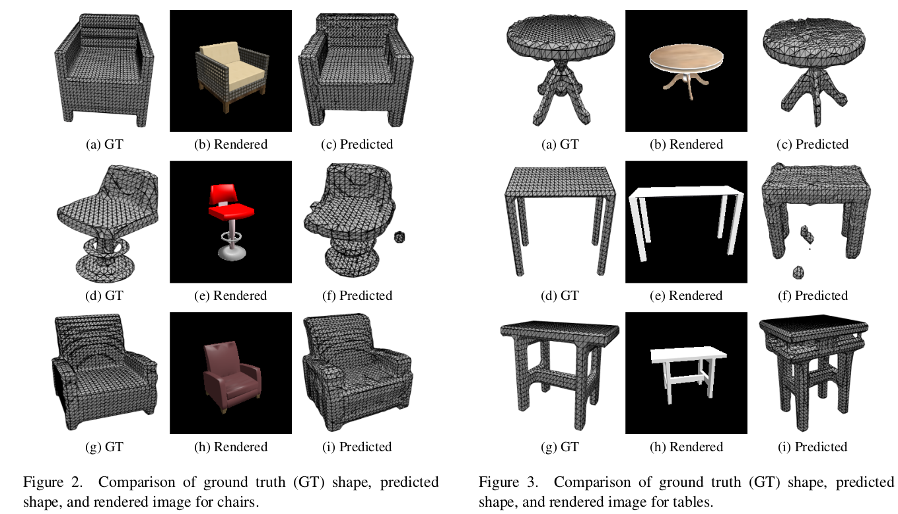

# SimpComp: Simple 3D Shape Completion using CLIP Guided Diffusion 

SimpComp is a project done as a part of the Advanced Computer Vision course where we propose a CLIP conditioned Diffusion model for 3D Shape completion from noisy or partial point clouds to enable multimodal, realistic, and high-fidelity 3D shape completion.



# Usage
Clone the repository using the follwing command:
```angular2html
git clone https://github.com/AnujShrivatsav/EECE7370.git
```

You can easily set up and activate a conda environment for this project by using the following commands:
```angular2html
conda create -n <env-name>
conda activate <env-name>
```
There is a requirements file provided to install all the neccessary dependencies and packages to run the code, install all the dependencies using:
```angular2html
cd Diff_Complete
pip install -r requirements.txt
```
To install CLIP in your environment run:
```angular2html
pip install ftfy regex tqdm
pip install git+https://github.com/openai/CLIP.git
```

<!-- conda env create -f environment.yml
conda activate diffcom -->

# Data Construction (Inside Diff_Complete)
For 3D-EPN dataset, we download the original data available from [3D-EPN](https://graphics.stanford.edu/projects/cnncomplete/data.html) for both training and evaluation purposes.
To run the default setting with a resolution of $32^3$, we download the necessary data files [shapenet_dim32_df.zip](http://kaldir.vc.in.tum.de/adai/CNNComplete/shapenet_dim32_df.zip) and [shapenet_dim32_sdf.zip](http://kaldir.vc.in.tum.de/adai/CNNComplete/shapenet_dim32_sdf.zip) for the completed and partial shapes, respectively. 

To prepare the data, you can run ```data/sdf_2_npy.py``` convert the files to ```.npy``` format for easier handling. Then, run ```data/npy_2_pth.py``` to obtain the paired data of eight object classes for model training.

The data structure should be organized as follows before training.

```
DiffComplete
├── data
│   ├── 3d_epn
│   │   ├── 02691156
│   │   │   ├── 10155655850468db78d106ce0a280f87__0__.pth
│   │   │   ├── ...  
│   │   ├── 02933112
│   │   ├── 03001627
│   │   ├── ...
│   │   ├── splits
│   │   │   ├── train_02691156.txt
│   │   │   ├── train_02933112.txt
│   │   │   ├── ...  
│   │   │   ├── test_02691156.txt
│   │   │   ├── test_02933112.txt
│   │   │   ├── ...  
```

# Training and Inference
Our training and inference processes primarily rely on the configuration files (```configs/epn_control_train.yaml``` and ```configs/epn_control_test.yaml```). You can adjust the number of GPUs used by modifying ```exp/num_gpus``` in these ```yaml``` files. This setting trains a specific model for each object category; thereby you could change ```data/class_id``` in the ```yaml``` file.

To train the diffusion model, you can run the following command:
```angular2html
python ddp_main.py --config-name epn_control_train.yaml
```

To test the trained model, you can denote the paths to the pretrained models by filling in ```net/weights``` and ```net/control_weights``` in the ```yaml``` file, and then run the following command:
```angular2html
python ddp_main.py --config-name epn_control_test.yaml train.is_train=False
```

## Acknowledgement

We would like to thank the following repos for their great work:

- This work is inspired by [DiffComplete](https://github.com/dvlab-research/DiffComplete).
- This work utilizes 3D-UNet from [Wavelet-Generation](https://github.com/edward1997104/Wavelet-Generation).
- This work utilizes the CLIP model for conditioning the diffusion model [CLIP](https://github.com/openai/CLIP)